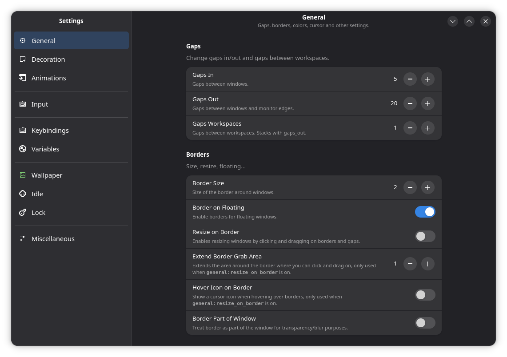

# Hyprset

A GTK4/LibAdwaita tool to configure your Hyprland desktop.

Built using [hyprparser-py](https://github.com/tokyob0t/hyprparser-py)



## Installation

### Dependencies

Hyprset requires:
- Python 3
- GTK4 & LibAdwaita
- PyGObject (`gi`)
- `hyprparser` (Python library)

### Flatpak (Recommended)

You can build and install **Hyprset** locally using the included manifest:

```bash
# 1. Install Builder
sudo dnf install flatpak-builder  # Fedora
sudo pacman -S flatpak-builder  # Arch

# 2. Build & Install
flatpak-builder --user --install --force-clean build-dir com.michaelmassoni.hyprset.yml
```

### Manual Setup
1. Clone the repository:
   ```bash
   git clone https://github.com/michaelmassoni/hyprset.git
   cd hyprset
   ```

2. Install dependencies:
   ```bash
   # Fedora
   sudo dnf install python3-gobject gtk4 libadwaita
   
   # Arch
   sudo pacman -S python-gobject gtk4 libadwaita
   ```

3. Install Python dependencies:
   ```bash
   pip install --user PyGObject
   ```
   *Note: `hyprparser` is currently expected to be in the python path or installed manually.*

## Usage

To launch the application:

```bash
python3 app/__main__.py
```

---

## Features

-   **Setup Wizard**: Automatically detects and downloads standard Hyprland config if missing.
-   **Full Configuration Control**:
    -   **General**: Gaps, borders, colors, cursor settings.
    -   **Decoration**: Rounding, blur, opacity, shadows, dimming.
    -   **Input**: Keyboard (Layout, Variant, Options), Mouse (Sensitivity, Accel), Touchpad, Tablet.
    -   **Gestures**: Workspace Swipe settings.
    -   **Miscellaneous**: Fonts, logo, disable autoreload.
-   **Advanced Keybinding Manager**:
    -   **List & Search**: Browse all your keybindings.
    -   **Record**: Easily add bindings by pressing the keys.
    -   **Edit & Delete**: Modify or remove existing bindings.
    -   **Advanced Manual Input**: Support for `$mainMod` and manual key entry.
    -   **Conflict Detection**: Warns before overwriting existing bindings.
    -   **Reset to Defaults**: One-click restore of standard Hyprland bindings.
-   **Variable Management**:
    -   Manage custom variables (e.g., `$mainMod`, `$terminal`, `$browser`).
    -   Smart insertion: keeps your config organized.
-   **Advanced Mode**: Toggle to hide/show complex settings for a cleaner experience.

---

## Roadmap

- [x] Support colors, gradients, etc.
- [ ] Add a preview for decoration settings
- [x] Keybinding management (Full CRUD + Recording)
- [x] Environment variables management
- [ ] Startup commands management
- [x] Pages:
  - [x] General
  - [x] Decoration
  - [x] Animations
  - [x] Input (with Advanced Mode)
  - [x] Gestures (Merged into Input)
  - [x] Misc (Miscellaneous)
  - [x] Keybindings
  - [x] Variables

